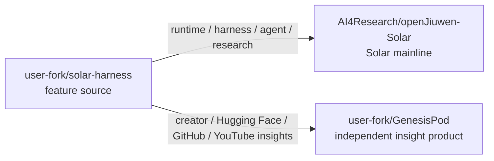
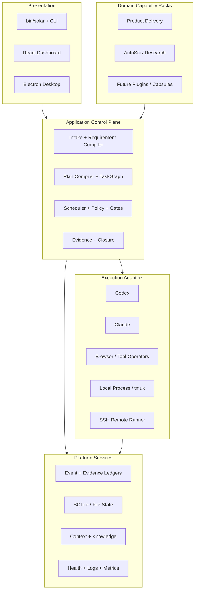
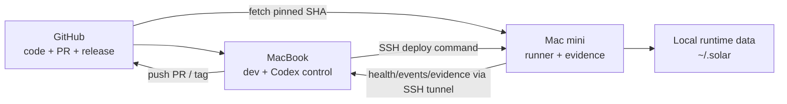

# OpenJiuwen Solar 目标项目架构

状态：Accepted for implementation

日期：2026-08-06

关联：[Development Context](./DEVELOPMENT_CONTEXT.md) · [PRD](./PRD.md) · [Delivery Contract](./DELIVERY_CONTRACT.md) · [Task Graph](./task_graph.json)

## 1. 结论

采用“本地优先的模块化单体 + 插件化能力 + 双机部署”的架构：

- `openJiuwen-Solar` 是唯一产品主干；
- `<user-fork>/GenesisPod` 是独立的洞察与报告产品，不是 AI4Research 的 UI；
- `<user-fork>/solar-harness` 是特性来源仓，不是第三条产品主干；
- `harness/` 是当前唯一 canonical execution runtime；
- `core/` 是可选控制面/兼容演进线，只能通过版本化契约与 Harness 交互；
- AutoSci、浏览器、知识库与未来 `solar-harness` 特性通过 plugin/capsule/adapter 进入；
- MacBook 管代码、Codex 与发布；Mac mini 只运行已验证 SHA；
- 运行状态永远在 Git 之外，部署与证据都绑定 commit SHA。

当前不采用微服务。系统仍是单用户、本地文件系统/SQLite/tmux 优先，过早拆分只会放大状态一致性和运维成本。

### 1.1 项目组合与迁移方向



两个目标项目分别开发、测试、提交、部署和回滚。跨项目复用必须先定义版本化 contract，再通过 adapter 或独立包实现；不得共享可变运行目录。

## 2. 当前代码判断

### 2.1 已形成的产品主线

仓库的真实主流程已经集中在 `harness/`：

```text
User request
  -> Requirement Compiler
  -> PRD / Contracts / TaskGraph
  -> Plan compiler + policy gates
  -> DAG scheduler
  -> Logical operator routing
  -> Physical operator / actor runtime
  -> Evidence + evaluator + human gate
  -> Closure projection
```

这一链路已有 CI、schema、gate ledger、event ledger、actor lease、operator registry 和 status server 支撑，应该继续作为功能演进中心。

### 2.2 当前主要结构风险

| 风险 | 代码事实 | 架构动作 |
|---|---|---|
| 双运行时语义漂移 | `harness/` 与 `core/` 同时存在 scheduler/daemon/orchestrator 概念 | 固定 Harness 为事实源，Core 走 adapter/API |
| 状态面过多 | graph、state、closure、event、gate、evidence、mailbox、tmux 并存 | 定义 event ownership 与 projection 顺序 |
| 仓库体积偏大 | `Feature list stuff/` 约 370 MB；Git pack 784 MiB | binary 外移，源码保留，后续再评估历史压缩 |
| 运行 artifacts 已跟踪 | `harness/artifacts/` 下 667 个 ignored-but-tracked 文件 | forward cleanup + fixture allowlist |
| 版本事实源分裂 | `VERSION=1.0.0-rc.9`，root package `3.0.0` | 由 `VERSION` 生成其他 metadata |
| 环境不可复现 | 本机 Python 3.9.6，项目要求 3.11+ | repo-local toolchain + doctor |
| 远程脚本与产品协议混杂 | 存在 sync/remote dispatch 脚本，但当前 runtime 仍单机优先 | 部署与运行协议分离，不宣称分布式 scheduler |

## 3. 逻辑分层



### 3.1 依赖规则

1. Presentation 只能调用 public CLI/API，不直接修改 runtime JSON/SQLite。
2. Domain pack 声明 capability、schema、effects 与 verifier，不拥有 scheduler。
3. Scheduler 依赖抽象 operator contract，不依赖具体 Codex/Claude 命令行细节。
4. Adapters 不自行决定任务完成；只返回结构化 result/evidence。
5. Event ledger 是状态变更审计源；projection 可重建，不能覆盖原始事件。
6. `core/` 不得建立与 Harness 并行的 canonical TaskGraph/evidence 数据库。

## 4. 物理目录映射

本阶段不做大规模搬目录；先通过 ownership、schema 与门禁固化边界。

| 架构模块 | 当前目录 | 定位 |
|---|---|---|
| CLI / lifecycle | `bin/`, `install.sh`, `lib/installer/` | 稳定公共入口 |
| Canonical runtime | `harness/` | Requirement、graph、scheduler、operator、evidence |
| Optional core | `core/` | Bun daemon/dashboard/compatibility；非事实源 |
| Product UI | `harness/status-server/react-app/`, `desktop/` | 只消费稳定 API |
| Research pack | `harness/plugins/autosci/`, `.agents/skills/` | 插件化领域能力 |
| Integration adapters | `codex-bridge/`, `integrations/`, `harness/lib/*adapter*` | 外部执行面 |
| Distribution | `components.d/`, `distribution/`, `deploy/` | 安装、发布、回滚 |
| Architecture contracts | `docs/architecture/`, schemas, ADRs | 设计事实源 |
| Runtime state | `~/.solar/` | 永不作为源代码提交 |

## 5. 数据与状态所有权

```text
Stable specification              Mutable runtime              Evidence/audit
--------------------              ---------------              --------------
request_envelope.json             task_dag.state.json           events.jsonl/db
requirement_ir.json               actor leases                  gate-ledger.jsonl
Contracts.yaml                    mailboxes                     evidence ledger
task_graph.json                   process/tmux state            closure.json
plan certificate                 heartbeats                    deployment record
```

规则：

- stable spec 通过 hash/certificate 防篡改；
- mutable state 只有一个声明 owner；
- ledger append-only；
- closure 是 projection，不是第二套输入事实源；
- schema 变更必须带版本、migration 与 rollback；
- 测试 fixtures 进入 Git，真实运行 artifacts 进入外部 artifact store。

## 6. 仓库与分支架构

### 6.1 推荐远端模型

当前 clone 先保持：

```text
origin -> Stellven/AI4Research
branch -> openJiuwen-Solar
```

当用户的 AI4Research fork 就绪后调整为：

```text
upstream -> Stellven/AI4Research       # 只读上游
origin   -> <user-fork>/AI4Research    # 用户可写 fork；真实 URL 仅存本机配置
```

主干与分支：

```text
upstream/openJiuwen-Solar
        |
        +-- codex/<feature>      short-lived development
        +-- codex/<fix>          defect repair
        +-- release/<version>    optional stabilization only
```

禁止长期 `develop` 分支，以免在 425-commit 产品分支之外再创建一条漂移主线。

### 6.2 仓库清理原则

- 保留：源码、schema、migrations、可复现 tests/fixtures、必要文档；
- Git LFS：必须版本化且无法重建的大型二进制源资产；
- GitHub Release/外部 artifact store：演示视频、构建物、测试证据包；
- 本地运行目录：数据库、日志、session、模型输出、缓存、sprint artifacts；
- 删除/历史压缩：只在备份 tag、镜像 clone、团队冻结窗口与用户授权后执行。

第一步做 forward cleanup，不立即 rewrite history。这样不会破坏现有 clone 与提交引用。

## 7. 双机拓扑



### 7.1 MacBook：开发与控制端

职责：

- 唯一日常编辑工作区；
- Codex Desktop/CLI、代码评审、测试和 PR；
- 生成发布 manifest、触发部署、读取监控；
- 保存架构文档与开发证据。

基线：

- 使用 `mise`/`pyenv`/Homebrew 中任一可复现方案固定 Python 3.12（最低 3.11）；
- `bun install --frozen-lockfile`；Python 使用 `.venv`；
- `codex doctor`、Solar doctor、privacy/release/core/harness gates；
- GitHub SSH key 与 Mac mini SSH key 分离；secret 进入 Keychain/环境注入。

### 7.2 Mac mini：运行与证据端

建议布局：

```text
~/Services/AI4Research/
  repo/                    # clean deployment clone, no manual edits
  releases/<sha>/          # immutable release/bundle
  current -> releases/<sha>

~/Services/GenesisPod/
  repo/                    # independent clean deployment clone
  releases/<sha>/          # independent immutable releases
  current -> releases/<sha>

~/.solar/
  config/                  # host config
  secrets/                 # chmod 600, never Git
  harness/                 # state, ledgers, artifacts, logs
  backups/
```

运行规则：

- 只运行 `deployment-manifest.json` 指定 SHA；
- launchd 负责进程生命周期；
- status server 默认 `127.0.0.1`；
- 部署前 preflight，切换后 health + smoke，失败自动恢复 previous SHA；
- 运行机不 push 源码，不承载长期开发分支。
- AI4Research 与 GenesisPod 使用独立 launchd label、端口、配置、secret、状态和日志目录。

## 8. Codex 远程控制设计

MacBook 与 Mac mini 的 Codex CLI 已升级到 `0.147.0`。稳定控制面使用已验证的 SSH key 通道；任何 Codex remote-control 实验能力只作为辅助路径：

1. 稳定控制路径：MacBook 通过 SSH 运行签名/受控部署脚本；
2. 辅助交互路径：Mac mini `codex remote-control start`；
3. 网络路径：只在 Mac mini loopback 监听，经 SSH local forwarding 暴露给 MacBook；
4. 认证：bearer token 由 Keychain/环境变量注入，不写 repo 或 shell history；
5. 权限：remote workspace allowlist 仅含 deployment checkout 与明确 runtime 目录；
6. 监控：Codex 只读取 status API、event/evidence ledger 和 launchd/tmux 状态；
7. 降级：remote-control 不可用时，SSH + `solar harness status/doctor` 仍可完成部署与监控。

## 9. 部署协议

```text
PR gates pass
  -> produce deployment manifest (sha/version/checksums/gates)
  -> Mac mini fetch exact SHA
  -> build/install in staging release dir
  -> preflight
  -> atomic current symlink switch
  -> start/reload launchd services
  -> health + deterministic smoke
  -> record evidence
  -> success, or rollback previous SHA
```

禁止把 `rsync` 当前工作树当作正式发布。已有 sync 脚本可保留用于开发实验，但生产路径必须 commit-addressed。

## 10. Harness 特性迁移协议

### 10.1 两阶段触发

- 第一阶段：用户已于 2026-08-10 释放已推送部分，允许固定 source SHA 后做只读 inventory 和逐特性迁移；
- 第二阶段：2026-05-20 至 2026-07-20 的未完成特性仍处于候选池，只有单项被选中后才能进入开发与测试。

### 10.2 导入流水线

```text
pin source SHA
  -> inventory features/files/contracts/tests
  -> classify
  -> map to target module/capsule/plugin
  -> conflict + privacy + license review
  -> one feature branch
  -> contract test / regression test
  -> minimal transplant or adapter
  -> full gates
  -> PR + rollback note
```

分类：

| 类型 | 处理 |
|---|---|
| Target 已有 | 做行为差异与测试补强，不重复导入 |
| 可直接移植源码 | 最小 patch/cherry-pick，保留来源 SHA |
| 需适配 | 通过 adapter/plugin/capsule 进入 |
| 运行时数据/日志/证据 | 不导入源码仓；转存 artifact store |
| 私密/机器相关配置 | 转模板与 schema，真实值不导入 |
| 废弃/重复/不可验证 | 记录理由并拒绝导入 |

目标路由：

| 特性 | 默认目标 |
|---|---|
| runtime、Harness、agent、research infrastructure | AI4Research |
| 大咖、Hugging Face、GitHub、YouTube 洞察与报告工作流 | GenesisPod |
| 共享协议/算法 | 版本化 contract + 两边 adapter |

### 10.3 为什么不做整仓 merge

目标分支已有 3,513 个 `harness/` tracked files，并包含成熟的 graph/operator/evidence/AutoSci 路径。整仓 merge 会同时引入状态 artifacts、路径假设、私密配置和重复实现，难以判断行为回归。逐特性迁移能把每项能力绑定到 contract、test 与回滚点。

## 11. 交付阶段

| 阶段 | 目标 | 退出门禁 |
|---|---|---|
| P0 Baseline | clone、事实盘点、架构契约 | SHA/branch/docs 可验证 |
| P1 Repository Hygiene | 清理 tracked runtime/binary/privacy/version 边界 | hygiene + privacy + release gates |
| P2 MacBook Bootstrap | 可复现开发工具链 | doctor + fast gate |
| P3 Mac mini Bootstrap | clean runner、launchd、状态隔离 | preflight + service health |
| P4 Deploy/Monitor | fixed-SHA 部署、回滚、监控 | deploy + rollback drill |
| P5 Codex Remote Assist | SSH tunnel 下远程辅助 | auth + workspace + fallback proof |
| P6 Phase 1 Imports | 已推送特性按目标路由逐项迁移 | source SHA + destination + contract/test/PR |
| P7 Phase 2 Selection | 5 月 20 日至 7 月 20 日未完成特性逐项选择 | 单项产品门禁 + 完整开发验证 |
| P8 Runtime Convergence | 评估 Core/Harness 收敛 | ADR revisit，不默认执行重写 |

## 12. 已接受的权衡

- 接受单机优先，换取较低复杂度和可调试性；
- 接受 Harness 继续作为 Python/Bash 主运行时，避免 RC 阶段重写；
- 接受 Core 暂时是可选演进线，但通过 boundary gate 阻止语义继续分叉；
- 接受 forward cleanup 不能立刻缩小 Git history，换取不破坏协作；
- 接受 Codex remote-control 是辅助路径，换取安全和稳定回退。

## 13. 复审点

- 完成 P1 后复审目录重构是否仍有收益；
- 完成第一次 Harness 特性迁移后复审导入协议；
- Codex remote-control 脱离 experimental 后复审其是否可成为正式控制面；
- 多运行节点出现后复审远程队列、集中状态库与故障转移。
